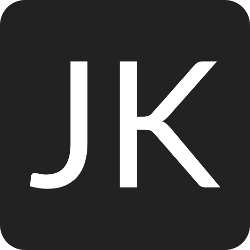

<!-- Improved compatibility of back to top link: See: https://github.com/othneildrew/Best-README-Template/pull/73 -->
<a name="readme-top"></a>
<!--
*** Thanks for checking out the Best-README-Template. If you have a suggestion
*** that would make this better, please fork the repo and create a pull request
*** or simply open an issue with the tag "enhancement".
*** Don't forget to give the project a star!
*** Thanks again! Now go create something AMAZING! :D
-->

<!-- PROJECT LOGO -->
<br />
<div align="center">
  <a href="https://github.com/CastillejaCode/portfolio">
    
  </a>

<h3 align="center">Julian's Website</h3>

  <p align="center">
    My personal website for showcasing my portfolio, blog, and reviews.
    <br />
    <br />
    <a href="https://github.com/CastillejaCode/portfolio">View Demo</a>
    ·
    <a href="https://github.com/CastillejaCode/portfolio/issues">Report Bug</a>
    ·
    <a href="https://github.com/CastillejaCode/portfolio/issues">Request Feature</a>
  </p>
</div>

<!-- ABOUT THE PROJECT -->
## About The Project
Desktop Light             |  Mobile Dark
-------------------------|-------------------------
  |  

### Built With

<a href="https://astro.build/">  

</a> 
<br/>
<a href="https://svelte.dev/">  

</a>

### How It's Made

I wanted to build a simple one-page personal website, and with each new project, I might as well learn something new.

So I picked Astro, a framework utilizing static site generation, which was the perfect use case for me; a small, fast, simple website.

The development process was enjoyable, and I tried to use as little Javascript as possible. The only two instances where I have it is for controlling light/dark mode and copying my email to the clipboard. 
I implemented both of these using Svelte since I wanted to practice using it after learning about it recently. 

### Optimizations

Using static site generation makes the website pretty fast already. The included images are also optimized by Astro. 

Designing the whole website ahead of time, for both mobile and desktop, in both light and dark mode, was very beneficial. I can mess up and develop the design much faster in Figma,
and then I just have to copy the design over. The design is also more coherent and clean. 

Initially I styled the whole website in Tailwind CSS, but I decided to convert everything to vanilla CSS since I felt like I was getting rusty with the fundamentals. 

Also, I had to change some things to be more accessible; I would rather have a more accessible website than a more aesthetic website (but you can certainly have both!). 
I was going to add some superfluous animations and the like, but at the end of the day, this website is just for information.


### Learning Outcomes

| The Good                               | The Bad                                              | The Ugly |
|----------------------------------------|------------------------------------------------------|----------|
| New framework was easy to implement    | Config for prettier and Astro was confusing at first |          |
| Designing beforehand, not while coding | Figuring out dark mode logic                         |          |
| Added dark mode                        | Converting Tailwind to vanilla CSS                                                      |          |
| Responsive design                      |                                                      |          |
| Learning vanilla CSS again               |                                                      |          |


<!-- GETTING STARTED -->
## Getting Started

If you want to get a local copy running for some reason, here you go.

### Prerequisites

* pnpm
  ```
  npm install -g pnpm
  ```

### Installation

1. Clone the repo
   ```
   git clone https://github.com/CastillejaCode/portfolio.git
   ```
2. Install NPM packages
   ```
   pnpm install 
   ```
3. Run local development server
   ```
   pnpm dev
   ```
 4. Switch out my info for yours

    For projects, you can just replace the array with your project objects, and they will be automatically created.
    You can also add any blog posts or reviews easily due to the content collection schema. 


<!-- LICENSE -->
## License

Distributed under the MIT License. See `LICENSE.txt` for more information.

<!-- CONTACT -->
## Contact

Julian Krzysiak - jkrzysiak13@gmail.com

<!-- ACKNOWLEDGMENTS -->
## Acknowledgments

* Favicon generator - [favicon.io](https://favicon.io/)
* Icons - [Hero Icons](https://heroicons.com/)
* Readme Template - [Best-README-Template](https://github.com/othneildrew/Best-README-Template)

<p align="right">(<a href="#readme-top">back to top</a>)</p>
